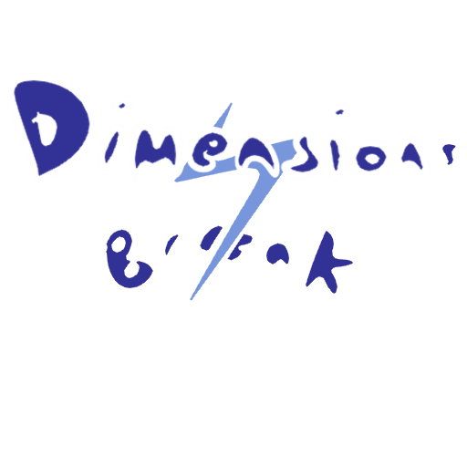

# Dimensions Break

Gioco sviluppato dal team Keep Playing per l'esame di sviluppo di videogiochi.

Team composto da:
- Corvaglia Carlo @CcCcCc99
- Di Gennaro Emmanuele @leletheprogrammer
- Di Gennaro Massimo @maxdgen
- Gallo Angela @h-angel22

Il è gioco realizzato in Godot Engine e tutti gli asset grafici sono stati disegnati dal team.

È stata completata solo una demo comprendente il tutorial ed il primo livello, che funge da incipit della trama e dimostrazione delle meccaniche.

La demo è disponibile [qui](https://github.com/CcCcCc99/SVG_Project/releases/tag/Demo2).

Il gioco nella forma completa è descritto nel [documento di game design](./GDD.pdf).
